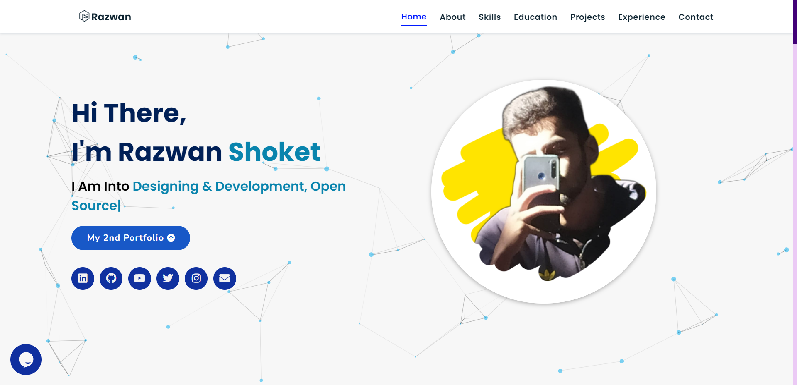

## Portfolio-Website
Portfolio website build using HTML5, CSS3, JavaScript and jQuery.

<h2> Website: 
<a href="https://dainty-choux-0d6924.netlify.app/">Visit Now🚀</a>
</h2> 

## 📌 Tech Stack:
[]
[]
[]

#### Extras : Particle.js, Typed.js, Tilt.js, Scroll Reveal, Tawkto, Font Awesome, JSON, etc.

## 📌 Sneak Peek of Main Page:

<h2>📬 Contact</h2>

If you want to contact me, you can reach me through below handles.

<a href="mailto:razwanshokett@gmail.com">

© 2021 Saurav Mukherjee

